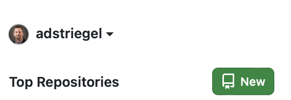
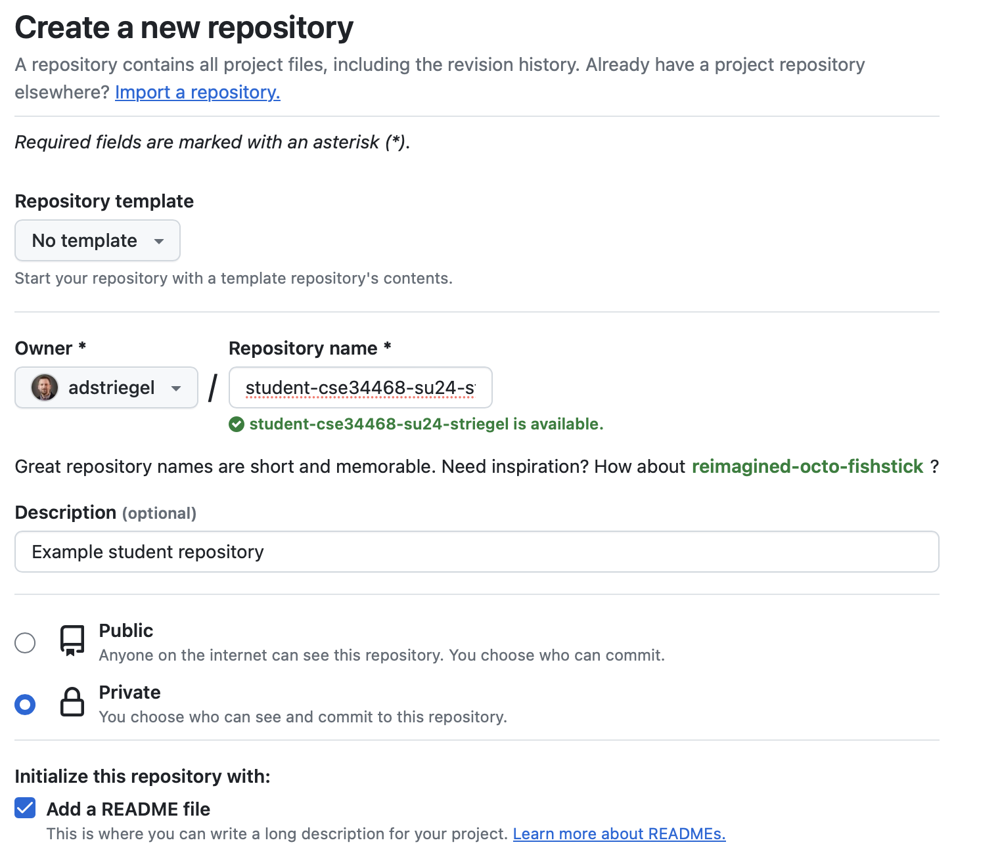
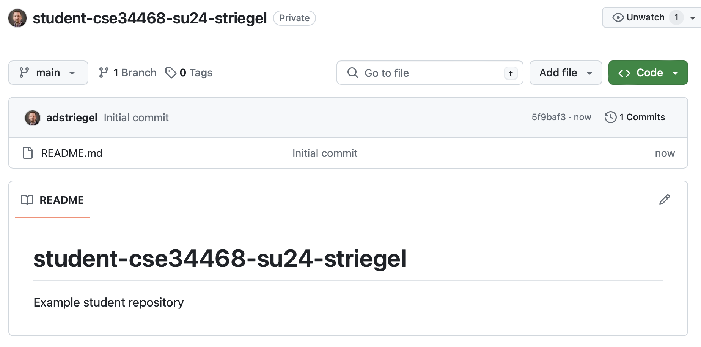
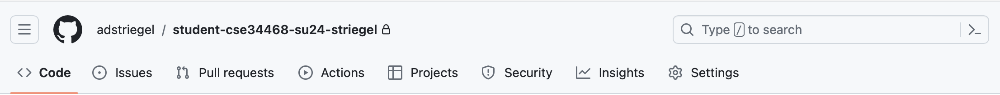
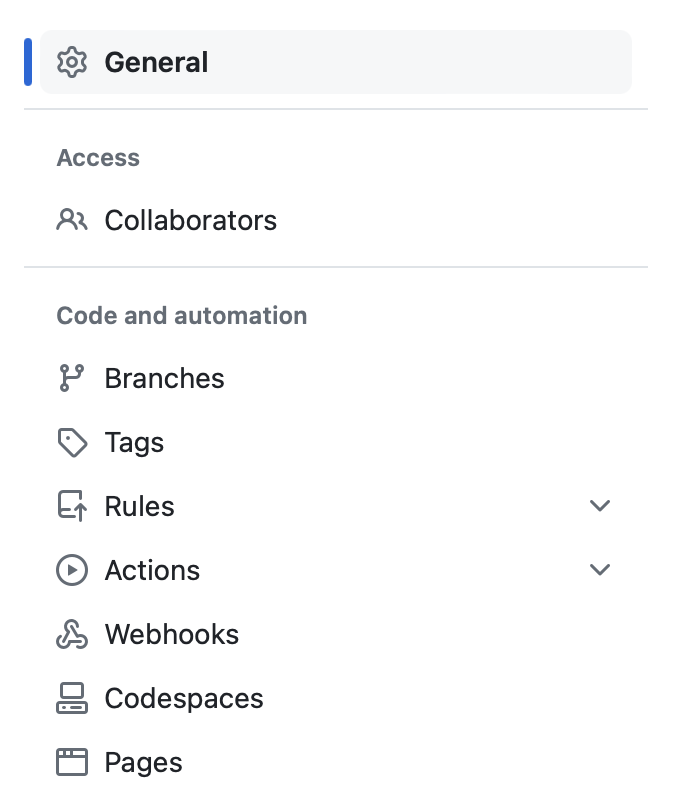
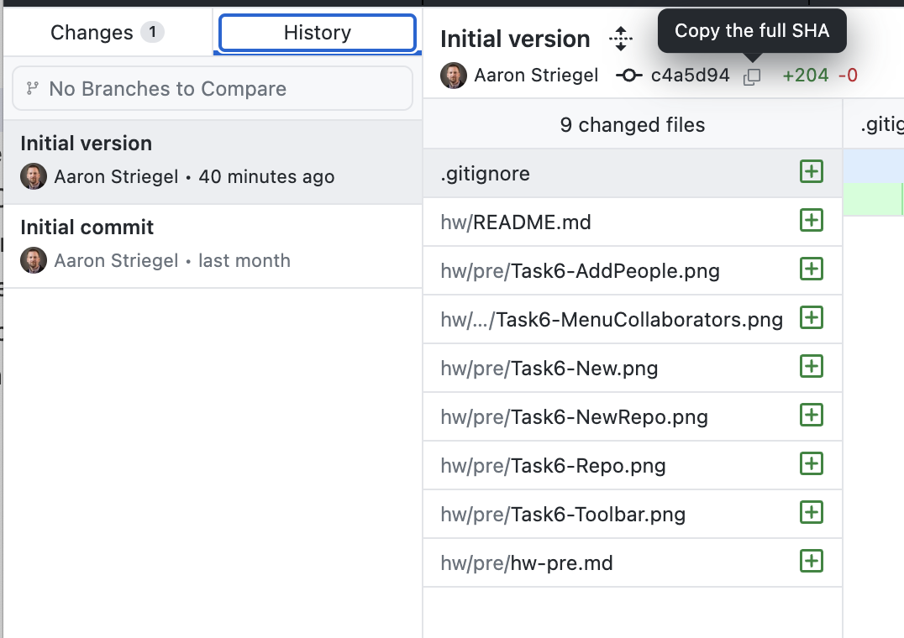

# Homework - Pre-Assignment

*Assigned:* May 01, 2024

*Due:* May 17, 2024, 10 PM EST

## Overview 

This assignment is to be completed prior to arriving to Berlin. It includes setting up a GitHub account for homework submissions, creating a private repository, extending access, and completing a first set of coding that will be emulated on the Raspberry Pi Sense HAT.

## Understanding the Assignment

For the programming portion of this class, we will be writing [Python](https://www.python.org) code that will be executing on the [Raspberry Pi](https://www.raspberrypi.org) with a special hardware board called a [Sense HAT](https://www.raspberrypi.com/documentation/accessories/sense-hat.html) that gives us a wide variety of interesting peripherals (temperature sensor, LEDs, joystick, buttons, gyroscope) available to embedded systems. 

The Raspberry Pi is a highly capable computer that falls into the category of what is known as a SoC or System on a Chip.  A System on a Chip means that almost everything that we need is contained on a single chip.  In particular, the Raspberry Pi is a fully capable computer that runs a full operating system.  The most common operating system run on a Raspberry Pi tends to be something called Raspbian which is a cutomized version of Linux which is an open-source variant of UNIX. The nice part with the Raspberry Pi being highly capable and running Linux is that we can use a wide variety of programming languages. In particular, Python is a fantastic language that is fairly reasonable for you to pick up and as an added bonus is also a super popular language.  

For the purpose of the class, the key part is that the Raspberry Pi devices that we will be using will have multiple peripherals and will be connected to the network via WiFi, hence falling into the category of what is known as the Internet of Things, e.g. an embedded system that has networking capabilities.  Throughout the expedited summer semester, we will be doing both smaller assignments outside of class as well as deeper labs that we will work on during the lecture.

Since we will be writing a fair amount of code, we need to have a way for you to be able to submit code and for myself as the instructor to be able to grade it.  While Canvas can be somewhat functional, it tends to be a bit rough.  Plus, we will also be doing a fair amount of group work together for the labs and having a mechanism for collaboration will also be helpful.

To that end, we will be using a source control tool called [git](https://www.atlassian.com/git/tutorials) hosted a platform called [GitHub](https://github.com). The actual tool itself can be a bit tricky so we will using a GUI (Graphical User Interface) to help us out though for those who are inclined, you are welcome to experiment with the command-line versions of *git* as you see fit.  

Overall, the goal of this pre-assignment is to complete several tasks that include:

* Task 1: Computer requirements / course policy on AI
* Task 2: Read the beginner Git tutorial
* Task 3: Set up a GitHub account
* Task 4: Install a Git GUI tool
* Task 5: Clone the class repository
* Task 6: Create a private repository and share it with the instructor
* Task 7: Create / commit your first files to the repo
* Task 8: Program the Sense HAT emulator

There are also several optional tasks that can be helpful but are not required:

* Install Python 
* Install a Sense HAT emulator

## Task 1 - Computer Requirements / AI Policy

**Computer Requirements:** For this class, you will need to have a reasonably capable laptop capable of running a Git GUI tool as well as browsing to the [Sense HAT emulator website](https://trinket.io/sense-hat). A tablet such as an iPad or mobile phone will be insufficient.  If you do not have access to a laptop, please reach out to Prof. Striegel as soon as possible.  

**AI Policy:** As we will be doing relatively introductory Python for the course, many AI tools tend to be quite capable of writing code (ChatGPT, Co-Pilot). We will at times look at these tools and their capabilities in class.  However, since these tools tend to do nearly all of the work, one can often arrive at solutions without truly understanding the why underneath them. Since the goal of the class is to understand the why, you cannot use AI solutions for your homework or labs. There will be a **zero** tolerance policy for AI-based solutions. A first violation will be a zero for that assignment and any subsequent cases will result in failing the course. 

**Honor Policy:** The course will have a blend of individual as well as group-based assignments and labs. Any individual assignments should be written exclusively by yourself.  Discussion with your classmates is OK, direct sharing / copying / modifications are not. A group assignment that is submitted should always have input from all group members with an equal amount of work undertaken by the entire group.

**Task:** Complete the following [Google Form](https://forms.gle/FZxWPArazJfAb8xn8). 

## Task 2 - Read the Beginner Git Tutorial

Starting here, read the following three sub-sections about versions control and Git.

* [What is version control](https://www.atlassian.com/git/tutorials/what-is-version-control)
* [Source Code Management](https://www.atlassian.com/git/tutorials/source-code-management)
* [What is Git](https://www.atlassian.com/git/tutorials/what-is-git)
* [Setting up a repository](https://www.atlassian.com/git/tutorials/setting-up-a-repository)
* [Saving changes](https://www.atlassian.com/git/tutorials/saving-changes)

**Task:** Read the five articles and complete the Git quiz in Canvas. The last two we will discuss more at the start of class but will provide you a good background. 

Throughout the summer semester, there will be pre-class quizzes related to the material that we will be covering that may involve reading / answering questions or preparing small amounts of pseudocode for the lab exercise that day.  

## Task 3 - Set up a GitHub Account

As noted earlier, assignments and labs will be submitted using a private GitHub repository. To that end, your next task is to create a [GitHub](https://github.com) account.  You are welcome to use either your Notre Dame e-mail or an external e-mail account.  You are also welcome to use an existing GitHub account if you have already created one prior to coming to Notre Dame.

For the purpose of the class, we will be creating private repositories where collaborator access will be granted to the instructor as well as group members.  For now, create a new GitHub account and complete the following Google Form to link your ND NetID to your GitHub username.  

**Task:** Complete the following [Google Form](https://forms.gle/7riW47cE6jk7Qzg67) to enter your NetID and your GitHub username.  

Note that you will never be prompted by myself or anyone else to share your password to your GitHub account.  

## Task 4 - Install a GitHub GUI Tool

For this class, we will be using [GitHub Desktop](https://desktop.github.com).  Download and install the relevant GitHub Desktop tool for your laptop.

**Task:** There is no specific form to complete outside of installing and running the GitHub Desktop tool successfully.  

## Task 5: Clone the Class Repository

As you read in Task 2, Git is a tool for managing software repositories.  It can also contain text and other relevant information which is where you are reading this assignment from.  Use the GitHub Desktop tool to *clone* the public repository for the class which can be found at the following URL:

https://github.com/adstriegel/cse34468-su24

The URL for cloning the repository is as follows:

https://github.com/adstriegel/cse34468-su24.git

Use that URL and create a clone of the class repository.  The class repository is where the majority of the information for the class will be located in terms of assignment information.  While we will still use Canvas for grade tracking, lecture slides, and quizzes, the class public repository will be the other primary source for course information.

For this repository, you will only have read access meaning that you can clone / update your local repository but you will not be able to commit changes to the repository.  

When you clone the class repository into a local repository, remember where the files are placed on your laptop.  Generally, it is recommended to make a sub-directory under which you place all repositories (e.g. Documents/repos).  

**Task:** Clone the class repository using the GitHub Desktop tool and locate this same file in the cloned repo under hw/pre/hw-pre.md. 

There is no specific submission step for this task.

## Task 6: Create a Private Repository

For assignment submissions, you will need to create a **private** repository.  You should name your repository in the following format:

`student-cse34468-su24-NETID`

where `NETID` is your Notre Dame NetID (e.g. `striegel`). It is up to you whether or not to have GitHub add the appropriate `README.md` file.  

To create a new repository, tap the **New** icon near the upper left.



Once you have selected to create a new repository, name your repository appropriately using your ND NetID.  Make sure your repository is **private** and then select Yes to having GitHub automatically include a `README.md` file.  You do not need to pick a repository template, a license, or add a `.gitignore`.  



Tap the **Create Repository** button which should take you to a web page that looks something like the following:



Check the URL (web address) for your repository.  It should look something like the following:

> https://github.com/adstriegel/student-cse34468-su24-striegel

where the GitHub username is right after github and the repository named that you used appears shortly after the GitHub username.  Use this address (also browseable when you go to github.com) to confirm what is visible in the cloud and visible for the purposes of class submissions. The date / times as recorded for GitHub will be used for tracking all due dates.

Next, tap on **Settings** which can be found in the toolbar for your repository.



From there, tap on **Collaborators** which can be found in the menu on the left.



You may need to authenticate again to ensure that you are indeed you as the action of adding or removing collaborators is a sensitive operation.  

Select **Add People** and add the username `adstriegel`

**Task:** Create your private repository, add Prof. Striegel (`adstriegel`), and complete the following [Google Form](https://forms.gle/Sd1ZUyuJnTvLFFXz6).  

Note that for group assignments (labs), you will select one student's repository to use for the submission.  In that case, you will extend collaborator access to each of your group members.  You are expected to abide by the Honor Code for any further individual assignments and not to browse through their repository when completing your own individual assignment.  

## Task 7: Clone / create / commit your first files to the repo

With your private repository now set up on GitHub, the next step is to clone your private repository locally on your laptop and to make changes and then to commit / push those changes back to the cloud-hosted repository.

Your next step is to clone your private repository to your laptop.  As your repository is private, it requires authentication (username / password) in order to be able to access the repository.  However, GitHub no longer lets you simply use a username / password for access and requires the usage of secure tokens for access.  Fortunately, the GitHub Desktop tool helps you out with all of this and navigating through the various two-factor / web authorization steps (think Okta but GitHub).  

**Task:** Clone your private repository to your laptop using the GitHub Desktop tool.  This is the URL that you just specified in the last task in the Google Form and should look something like: 

`https://github.com/adstriegel/student-cse34468-su24-striegel`

except with your NetID instead of `striegel`.  

Similar to how you found the file hw-pre.md in the last step, figure out where exactly your repository is stored on your laptop. Your laptop should have two different repositories, one that is the course repository named `cse34468-su24` and one that is your private repository. Make sure that both repositories exist.

Once you have confirmed that the repository is present, we need to find an editor that will let us edit code and various documentation.  [Visual Studio Code](https://code.visualstudio.com) is a fantastic and highly capable IDE (Integrated Development Environment) that nicely highlights syntax and generally makes coding easier.  Other tools such as [Notepad++]() for Windows are also great as well.

**Task:** Download and install Visual Studio Code on your laptop.  

Once you have Visual Studio Code installed, open VS Code and use the Open Folder action (File -> Open Folder) and then browse to your private repository.  

When opening your repository for the first time, you may need to trust the repository.  Since you are going to be the author for all of the code that will be present, you should definitely trust your own code.

**Task:** Create, edit files and directories

If there is a `README.md` file present, click to open up the file inside of the editor.  If not, create a new file inside of the repository named `README.md`.  

The .md extension denotes that the file contains [Markdown](https://www.markdownguide.org) text which is a formatting style to create marked text that looks a bit better than a plain text file allowing for bullets, bold, italics, links, and various other features without going all the way to a Microsoft Word or Google Doc.

Modify your `README.md` file to include the following:

* Your name
* Your e-mail

Create a sub-directory named *pre* inside of your repository.  Inside of that *pre* sub-directory, make a file named *pre.md* and add the following text to the file.  For the purpose of the course, we will be putting each specific assignment in its own sub-directory.  It will be very importance for the purpose of keeping your instructor happy to put files in the right locations to allow for simplified testing of the various submissions.  

``` 
# Pre-Assignment - Summer 2024 - Berlin

This is a file and directory to demonstrate proper placement and eventually pushing 
of the content to the GitHub private repository.  
```

### Committing Changes Locally and Pushing to GitHub

At this point once you have saved these files, you have only saved these files on your laptop.  Some of the files (README.md) may be tracked by Git while other files are effectively just present like normal files on your computer.  We want to have Git track all of the files and appropriately push changes to the remote repository in the cloud (at github.com).

There are three logical steps involved:

* `add` the file to git to have it tracked
   * This step is included with the commit in GitHub Desktop
* `commit` changes to the final and / or the initial version including a message that describes what is involved in the respective changes
   * As an aside, we will always be committing changes to the *main* branch
   * For every assignment, you will hopefully have multiple commits
* `push` causes the changes to be pushed from your local repository to the cloud repository

Generally, once you create the file, the sequence will drop down to just the last two steps.  You *commit* changes to the local repository.  Logically, you can think of that as saving checkpoints or historical versions (e.g. track changes).  Once committed, you then *push* the changes to the cloud.  

Once the changes have been pushed to the cloud, you will be able to see your files present via github.com.  

**Task:** Add / commit the changes to your repository and push your change to GitHub.  Browse to your repository on GitHub.com and confirm that everything is present (README.md, pre/pre.md).

### Code Submissions - GitHub + SHA Hash on Canvas

Finally, for the purposes of your assignments, there will be two parts to any submission.  You will commit and push your changes to GitHub and then you will also submit the hash of your commit via Canvas.  

To get the commit hash for your commit while in your repository, click on History in GitHub Desktop and select the version that you are interested in viewing. In the middle upper right, there is a hexadecimal number that is the SHA Hash.  



**Task:** Copy the hash and submit it in the text field for the Task 7 pre-assignment on Canvas. 

## Task 8: Program the Sense HAT emulator

1. Browse to the [Sense HAT emulator](https://trinket.io/sense-hat)
2. Run the code that is present on the site
3. Browse to the [modified code in the class repository](https://github.com/adstriegel/cse34468-su24/blob/main/hw/pre/mod-sense.py)
4. Copy / paste the code into the code block on the Sense HAT site
5. Stop the code and run the code
6. Modify the code to show a letter N and a letter D
7. Copy your working code into a file named hat-mine.py in the pre/ directory of your private repository
8. Commit and push the change to your repository
9. Submit the hash of your commit via Canvas


